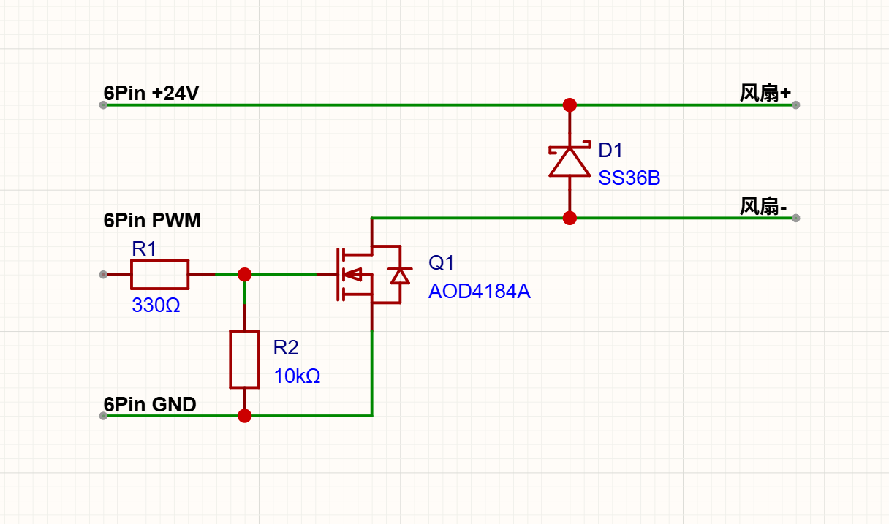

# PogoFree

Snapmaker U1 PogoPin 改固定线缆的一键配置脚本，支持方案 A、方案 B 和恢复原厂配置。

已在 U1 固件 `1.5.2.13` 上完成真机验证。脚本只修改：

```text
/home/lava/printer_data/config/printer.cfg
```

## 使用前提

- 建议先完成对应方案的硬件接线。
- 使用 `root` 账户登录打印机。
- 修改前会额外备份完整的 `printer.cfg`。

## 上传和运行

下载仓库中的 `pogofree.sh`，用 WinSCP 上传到打印机：

```text
/tmp/pogofree.sh
```

SSH 登录打印机后执行：

```sh
sh /tmp/pogofree.sh
```

按中文菜单选择：

```text
1) 方案 A：复用一个工具头的风扇接口
2) 方案 B：官方顶盖 6Pin 接口 + 外置 MOSFET
3) 恢复安装器管理的原始配置
4) 查看安装器状态
```

## 方案 A

把共享风扇固定接到一个工具头的风扇接口。安装时选择 `1-4` 号工具头，脚本会配置对应的 `PB3/PB4`，并让四个工具头共用这一套风扇。

## 方案 B

使用官方顶盖 6Pin 接口 PCB 丝印标注的 `24V / PWM / GND`，通过外置 MOSFET 驱动共享风扇（电路接法在文档最后）。脚本使用：

```text
PWM: PA8
供电使能: PE15
cycle_time: 0.0005
```

## 验证

安装完成后，依次挂载和停靠四个打印头，并执行：

```gcode
QUERY_PARK_STA NAME=extruder
QUERY_PARK_STA NAME=extruder1
QUERY_PARK_STA NAME=extruder2
QUERY_PARK_STA NAME=extruder3
```

预期状态：

```text
停靠：park=True,  grab=False -> PARKED
挂载：park=False, grab=True  -> ACTIVATE
异常：其他组合                 -> UNKNOWN
```

确认四个打印头换头正常、主散热风扇可调后，再开始打印测试。


## 方案B接法


需要：AOD4184A，SS36B，10KΩ电阻，330Ω电阻各一个。

<p align="left">
  
</p>
